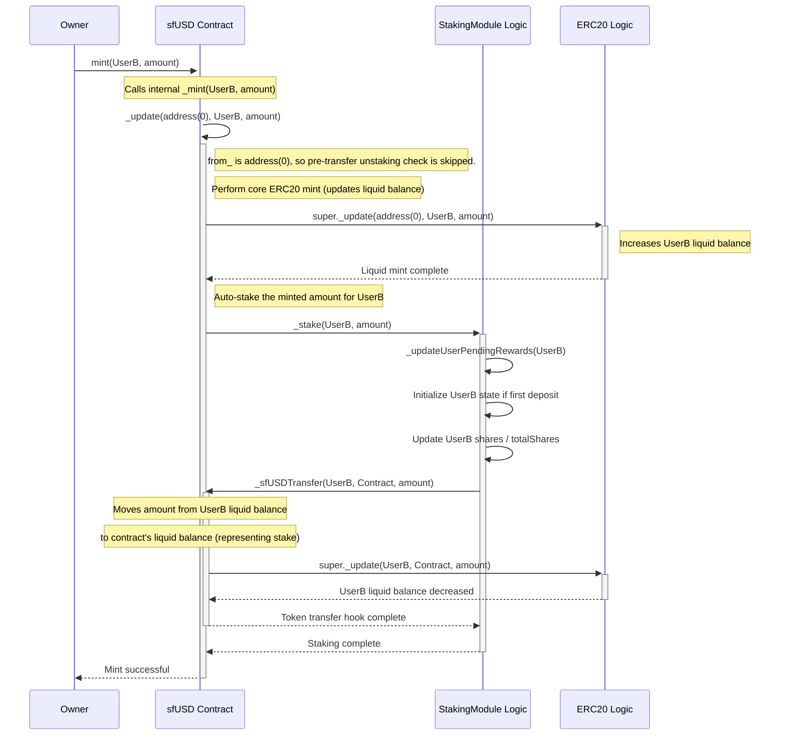

# sfUSD

## Overview

`sfUSD` is an ERC20-compliant token designed with a built-in staking mechanism. Unlike traditional yield-bearing tokens where users must explicitly stake their tokens in a separate contract, minting `sfUSD` automatically stakes the user's balance. Rewards generated by the underlying protocol (funded by depositing a separate `rewardToken`) are distributed proportionally to all `sfUSD` holders based on the duration and amount of their holdings.

The system uses a snapshot-based reward distribution mechanism implemented in the `StakingModule` contract, which `sfUSD` inherits from.

## Core Concepts

1.  **Automatic Staking**: When a user receives `sfUSD` (via minting), the tokens are automatically added to their staked balance within the integrated `StakingModule`.
2.  **Unified Balance**: The `balanceOf` function returns the user's *total* balance, which is the sum of their liquid (standard ERC20) balance and their staked balance managed by the `StakingModule`.
3.  **Automatic Unstaking**: When a user transfers or burns `sfUSD`, the contract first attempts to use their liquid balance. If the liquid balance is insufficient, the contract automatically unstakes the required amount from their staked balance to fulfill the operation.
4.  **Snapshot Rewards**: Rewards (in the form of a separate `rewardToken`) are deposited by an administrator. Each deposit creates a snapshot of the system's state (total shares, time, cumulative reward metrics). Rewards accrued between snapshots are distributed proportionally to users based on their staked shares during that period.
5.  **Reward Claiming**: Users must explicitly call `claimRewards()` to receive their accrued `rewardToken` rewards.

## Architecture

The system primarily consists of the `sfUSD` token contract, which inherits and utilizes the logic from the abstract `StakingModule`.

## Automatic Staking Flow (`mint`)

The following diagram illustrates how a standard `mint` call interacts with the staking module via the overridden `_update` function.



## Reward Distribution Flow

1.  **Deposit Rewards**: Admin calls `depositRewards(rewardAmount)`.
2.  **Snapshot**: `StakingModule` updates reward metrics (`cumulativeSum`, `snapshotTotalVirtualRewards`) based on time elapsed since the last update/snapshot. A new snapshot `N` is created:
    *   `snapshotId` increments to `N+1`.
    *   `snapshotCumulativeSum[N]` = current `cumulativeSum`.
    *   `snapshotDepositTime[N]` = `block.timestamp`.
    *   `snapshotTotalActualRewards[N]` = `snapshotTotalActualRewards[N-1]` + `rewardAmount`.
    *   `snapshotTotalVirtualRewards[N]` = `snapshotTotalVirtualRewards[N-1]` + virtual rewards accrued since snapshot `N-1`.
3.  **User Claims**: User calls `claimRewards()` or `claimRewardsUntil(targetSnapshot)`.
4.  **Calculate Pending**: The `_updateUserPendingRewards` function iterates through snapshots from the user's `lastProcessedSnapshot + 1` up to the target snapshot.
    *   For each snapshot period `S`:
        *   Calculate the user's `userVirtualRewards` earned during period `S` (based on their shares and the change in `cumulativeSum` or their `owedValue`).
        *   Calculate the actual reward rate for period `S`: `(snapshotTotalActualRewards[S] - snapshotTotalActualRewards[S-1]) / (snapshotTotalVirtualRewards[S] - snapshotTotalVirtualRewards[S-1])`. *Note: The implementation uses totals and claimed amounts to achieve the same result.*
        *   Add `userVirtualRewards * rate` to the user's `pendingRewards`.
        *   Update the user's `lastProcessedSnapshot` and `claimedRewards` markers.
5.  **Transfer Rewards**: The calculated total `pendingRewards` (actual `rewardToken`) is transferred to the user.

## Installation

First of all, you will need `npm` and `foundry` to be able to compile and run tests in this project.

See here for Node.js installation: https://docs.npmjs.com/downloading-and-installing-node-js-and-npm  
And here for instructions on how to install Foundry: https://book.getfoundry.sh/getting-started/installation

You can use the following sequence of commands to install the dependencies for the repository:

```bash
npm install && npm run init
```

You can run the following command to compile the contracts:

```bash
npm run compile
```

You can run the following command to run the tests:

```bash 
npm run test
```

You can run the following command to check coverage:

```bash 
npm run coverage
```

## Deployment Guide

This guide covers deploying the `sfUSD` smart contract system to various networks using Hardhat and the `@solarity/hardhat-migrate` plugin.

### Prerequisites

Before deploying, ensure you have the following installed:

1. **Node.js** (version 20 or higher) - [Installation Guide](https://docs.npmjs.com/downloading-and-installing-node-js-and-npm)
2. **Foundry** - [Installation Guide](https://book.getfoundry.sh/getting-started/installation)
3. **Git** - For cloning the repository

### Environment Setup

1. **Install Dependencies**
```bash
npm install && npm run init
```

2. **Set Up Environment Variables (if needed)**
   
Create a `.env` file in the root directory with the following variables (if needed):
```env
# Network RPC URLs
INFURA_KEY=your_infura_project_id
ALCHEMY_KEY=your_alchemy_api_key

# Block Explorer API Keys (for contract verification)
ETHERSCAN_KEY=your_etherscan_api_key
BSCSCAN_KEY=your_bscscan_api_key
POLYGONSCAN_KEY=your_polygonscan_api_key
AVALANCHE_KEY=your_avalanche_api_key

# Use with caution: 
PRIVATE_KEY=0x...
```

3. **Verify Configuration**
```bash
npm run compile
```

### Network Configuration

The deployment system supports multiple networks. To add a new network, follow these steps:

1. **Add Network to Hardhat Config**
   
Networks are already configured in `hardhat.config.ts`. Example supported networks:
- **Mainnets**: `ethereum`, `bsc`, `polygon`, `avalanche`
- **Testnets**: `sepolia`, `chapel`, etc.

2. **Create Network Configuration**
   
For each network, create a configuration file in `deploy/config/`:
   
```bash
# Example: Create configuration for Sepolia testnet
cp deploy/config/localhost.ts deploy/config/sepolia.ts
```
   
Edit the configuration file with network-specific parameters:
```typescript
// deploy/config/sepolia.ts
export const tokenName = "sfUSD Sepolia";
export const tokenSymbol = "sfUSD";
export const rewardToken = "0x..."; // Address of reward token on Sepolia, ex. address of USDC
```

3. **Update Main Configuration**
   
Add the new network to `deploy/config/config.ts`:
```typescript
import hre from "hardhat";

export async function getConfig() {
    if (hre.network.name == "localhost" || hre.network.name == "hardhat") {
        return await import("./localhost");
    }
    if (hre.network.name == "sepolia") {
        return await import("./sepolia");
    }
    // Add other networks...
    
    throw new Error(`Config for network ${hre.network.name} is not specified`);
}
```

### Deployment Commands

#### Basic Deployment

Deploy to a specific network:
```bash
npx hardhat migrate --network <networkName>
```

Note: (dangerous) on how to import private key with hardhat: https://hardhat.org/hardhat-runner/docs/config#available-config-options

#### Deployment with Verification

Deploy and automatically verify contracts:
```bash
npx hardhat migrate --network <networkName> --verify
```

#### Deployment with External Account

Deploy using an external wallet (requires Cast wallet setup):
```bash
npx hardhat migrate --network <networkName> --verify --account <accountName>
```

### Local Testing

To test your deployment locally:

1. **Start Local Node**
```bash
# Terminal 1
npx hardhat node
```

2. **Run Migration**
```bash
# Terminal 2
npx hardhat migrate --network localhost
```

3. **Verify Local Deployment**
```bash
# Check deployed contracts by reading deployed contract state
npx hardhat console --network localhost
```

### Contract Verification

#### Automatic Verification

The `--verify` flag automatically verifies contracts after deployment:
```bash
npx hardhat migrate --network mainnet --verify
```

#### Manual Verification

If automatic verification fails, you can verify contracts manually:
```bash
npx hardhat verify --network <networkName> <contractAddress> <constructorArgs>
```

#### Custom Networks

For networks not supported by default, add custom verification endpoints to `hardhat.config.ts`:

```typescript
etherscan: {
  apiKey: {
    customNetwork: "your_api_key"
  },
  customChains: [
    {
      network: "customNetwork",
      chainId: 12345,
      urls: {
        apiURL: "https://api.custom-explorer.com/api",
        browserURL: "https://custom-explorer.com"
      }
    }
  ]
}
```

More information here: https://hardhat.org/hardhat-runner/plugins/nomicfoundation-hardhat-verify#adding-support-for-other-networks 

### Using External Wallets

For production deployments, use external wallets for enhanced security:

1. **Cast Wallet Integration Example**
   
Set up Cast wallet following the [Cast Wallet Guide](https://github.com/dl-solarity/hardhat-migrate/blob/master/docs/ExternalWallets.md#cast-wallet-integration)

2. **Deploy with Cast Wallet**
```bash
npx hardhat migrate --network mainnet --verify --account production-wallet
```

### Troubleshooting

#### Common Issues

1. **"Config for network X is not specified"**
   - Create a configuration file for the network in `deploy/config/`
   - Update `deploy/config/config.ts` to include the new network

2. **Verification Failures**
   - Verify API keys are correct
   - Check if the network supports verification
   - Try manual verification with `hardhat verify`

3. **Deployment Hanging**
   - Check RPC endpoint connectivity
   - Verify account has sufficient balance
   - Increase transaction timeout in network config

#### Getting Help

- **Hardhat Migrate Documentation**: https://github.com/dl-solarity/hardhat-migrate
- **Hardhat Verify Documentation**: https://hardhat.org/hardhat-runner/plugins/nomicfoundation-hardhat-verify
- **Network Configuration**: Check your network's documentation for RPC endpoints and explorer URLs

### Security Considerations

1. **Private Keys**: Never commit private keys to version control
2. **Environment Variables**: Use `.env` files for sensitive data
3. **Network Verification**: Always verify deployed contracts on block explorers
4. **Testing**: Thoroughly test on testnets before mainnet deployment

