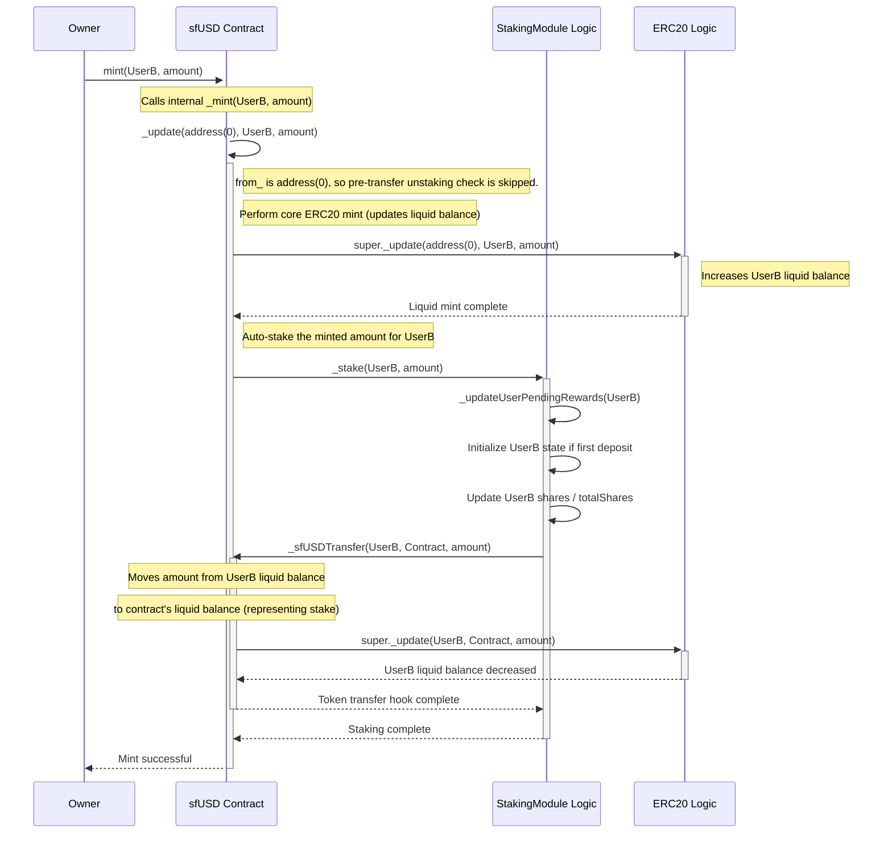

# sfUSD

## Overview

`sfUSD` is an ERC20-compliant token designed with a built-in staking mechanism. Unlike traditional yield-bearing tokens where users must explicitly stake their tokens in a separate contract, minting `sfUSD` automatically stakes the user's balance. Rewards generated by the underlying protocol (funded by depositing a separate `rewardToken`) are distributed proportionally to all `sfUSD` holders based on the duration and amount of their holdings.

The system uses a snapshot-based reward distribution mechanism implemented in the `StakingModule` contract, which `sfUSD` inherits from.

## Core Concepts

1.  **Automatic Staking**: When a user receives `sfUSD` (via minting), the tokens are automatically added to their staked balance within the integrated `StakingModule`.
2.  **Unified Balance**: The `balanceOf` function returns the user's *total* balance, which is the sum of their liquid (standard ERC20) balance and their staked balance managed by the `StakingModule`.
3.  **Automatic Unstaking**: When a user transfers or burns `sfUSD`, the contract first attempts to use their liquid balance. If the liquid balance is insufficient, the contract automatically unstakes the required amount from their staked balance to fulfill the operation.
4.  **Snapshot Rewards**: Rewards (in the form of a separate `rewardToken`) are deposited by an administrator. Each deposit creates a snapshot of the system's state (total shares, time, cumulative reward metrics). Rewards accrued between snapshots are distributed proportionally to users based on their staked shares during that period.
5.  **Reward Claiming**: Users must explicitly call `claimRewards()` to receive their accrued `rewardToken` rewards.

## Architecture

The system primarily consists of the `sfUSD` token contract, which inherits and utilizes the logic from the abstract `StakingModule`.

## Automatic Staking Flow (`mint`)

The following diagram illustrates how a standard `mint` call interacts with the staking module via the overridden `_update` function.



## Reward Distribution Flow

1.  **Deposit Rewards**: Admin calls `depositRewards(rewardAmount)`.
2.  **Snapshot**: `StakingModule` updates reward metrics (`cumulativeSum`, `snapshotTotalVirtualRewards`) based on time elapsed since the last update/snapshot. A new snapshot `N` is created:
    *   `snapshotId` increments to `N+1`.
    *   `snapshotCumulativeSum[N]` = current `cumulativeSum`.
    *   `snapshotDepositTime[N]` = `block.timestamp`.
    *   `snapshotTotalActualRewards[N]` = `snapshotTotalActualRewards[N-1]` + `rewardAmount`.
    *   `snapshotTotalVirtualRewards[N]` = `snapshotTotalVirtualRewards[N-1]` + virtual rewards accrued since snapshot `N-1`.
3.  **User Claims**: User calls `claimRewards()` or `claimRewardsUntil(targetSnapshot)`.
4.  **Calculate Pending**: The `_updateUserPendingRewards` function iterates through snapshots from the user's `lastProcessedSnapshot + 1` up to the target snapshot.
    *   For each snapshot period `S`:
        *   Calculate the user's `userVirtualRewards` earned during period `S` (based on their shares and the change in `cumulativeSum` or their `owedValue`).
        *   Calculate the actual reward rate for period `S`: `(snapshotTotalActualRewards[S] - snapshotTotalActualRewards[S-1]) / (snapshotTotalVirtualRewards[S] - snapshotTotalVirtualRewards[S-1])`. *Note: The implementation uses totals and claimed amounts to achieve the same result.*
        *   Add `userVirtualRewards * rate` to the user's `pendingRewards`.
        *   Update the user's `lastProcessedSnapshot` and `claimedRewards` markers.
5.  **Transfer Rewards**: The calculated total `pendingRewards` (actual `rewardToken`) is transferred to the user.

## Installation

First of all, you will need `npm` and `foundry` to be able to compile and run tests in this project.

See here for Node.js installation: https://docs.npmjs.com/downloading-and-installing-node-js-and-npm  
And here for instructions on how to install Foundry: https://book.getfoundry.sh/getting-started/installation

You can use the following sequence of commands to install the dependencies for the repository:

```bash
npm install && npm run init
```

You can run the following command to compile the contracts:

```bash
npm run compile
```

You can run the following command to run the tests:

```bash 
npm run test
```

You can run the following command to check coverage:

```bash 
npm run coverage
```

