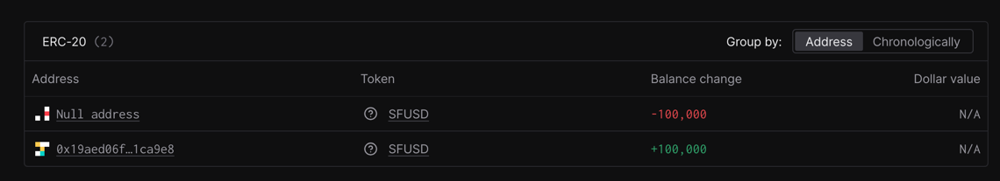

# Minting Process

The owner of the [sfUSD contract](https://etherscan.io/address/0x19aed06f6b87aca2010e49c573330398381ca9e8) is the [Safe account](https://app.safe.global/home?safe=eth:0xc24ee75bC645Eb696247449f2B5B596dAEDd7ECD).

Therefore, the mint operation should be completed via the Safe UI.

1. Go to the [Safe account](https://app.safe.global/home?safe=eth:0xc24ee75bC645Eb696247449f2B5B596dAEDd7ECD).
2. Click `New transaction`, then select `Transaction Builder`.
3. Use the sfUSD contract address [0x19aed06f6b87aca2010e49c573330398381ca9e8](https://etherscan.io/address/0x19aed06f6b87aca2010e49c573330398381ca9e8) in the `Enter Address` field.
4. Replace the ABI in the `Enter ABI` field with the ABI from the [implementation](https://etherscan.io/address/0x4812a17a7025ae348574f1542cadbc90de5553aa#code) (scroll to the bottom to the `Contract ABI` section and click the copy button).
5. Select the `mint` function.
6. Enter the address in the `to_` field and the amount in wei in the `amount_` field.
7. Click `Add new transaction`, then click `Create batch`.
8. Click the `Simulate` button. As soon as the simulation is completed, click the `on Tenderly` URL and verify the correctness of the transaction.

For example, if you decide to mint 100,000 tokens to `0x19aed06f6b87aca2010e49c573330398381ca9e8`, you should see the following box in Tenderly:

9. After verification is completed, click `Send batch` and proceed with sending the transaction via Gnosis Safe, following its instructions.
